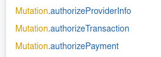
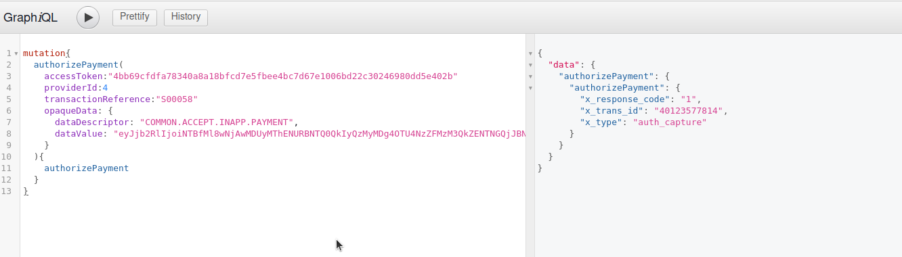
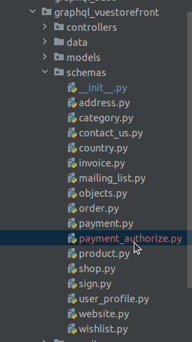
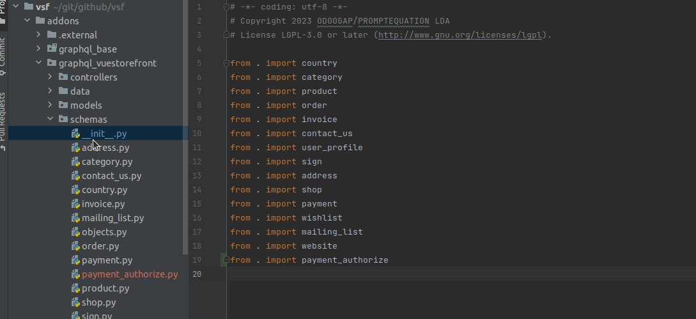
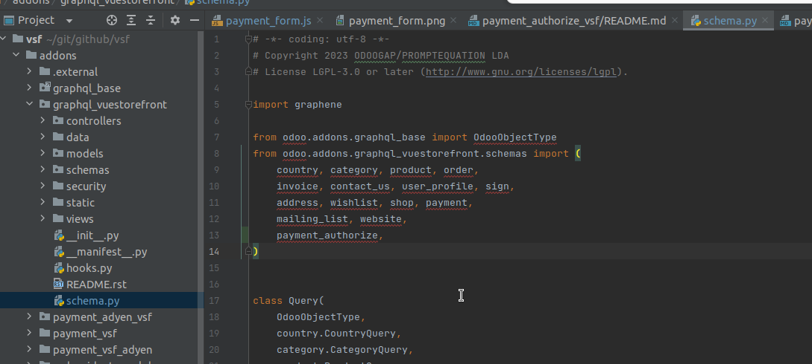
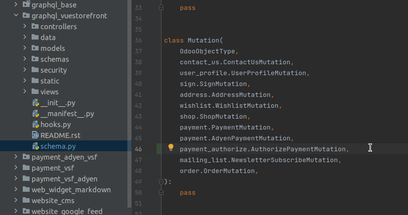
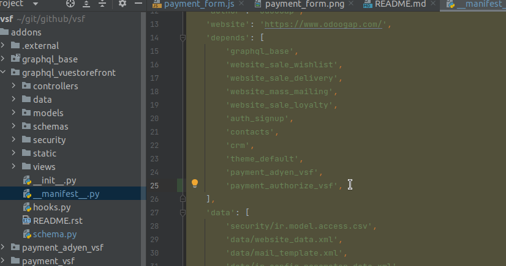
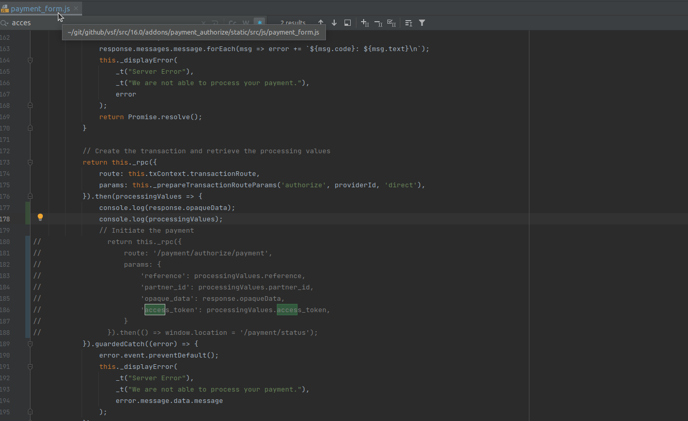
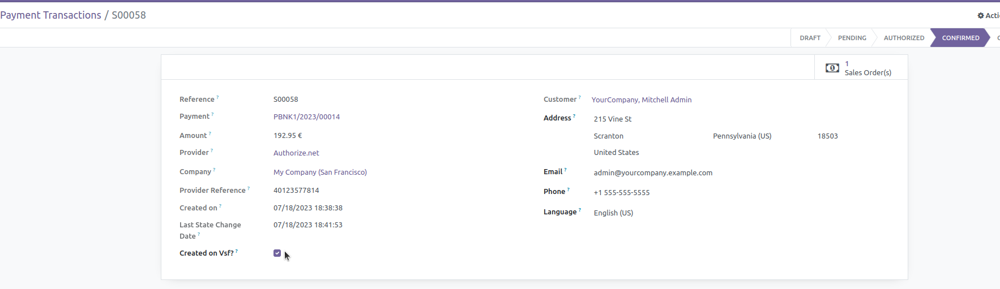

# Authorize Payment Customization

## 1- Description:

##### - Adapting the Authorize Payment Acquirer to work correctly with the VSF;

##### On this module we have 3 Mutations that should be used on the vsf website, to be possible execute one payment with the Authorize.Net Payment Provider;

### These are the mutations:

##### -> authorizeProviderInfo - This Mutation will give us the credentials that we will need to generate the payment form;
##### -> authorizeTransaction - This Mutation will let us create the Payment Transaction;
##### -> authorizePayment - This Mutation will be used to make the payment;

### Mutation authorizeTransaction:

#### -> We need to take care with some fields:

#### **tokenizationRequested** -> This field is responsible for save or not the "credit cards";  

### Mutation AuthorizePayment:

#### -> We need to take care with some fields:

##### **accessToken** -> We will get this field from the authorizeTransaction result;
##### **transactionReference** -> We will get this field from the authorizeTransaction result;
##### **opaqueData** -> We will get this field from the result that we will get when we click on the submit button on the payment form;

##### Note: We should submit first the payment form, then we should get the opaqueData result from that submit, and then we should execute the authorizePayment Mutation;

##### Depending on the result, we should redirect the user to the success/error Payment Page;

## 2- How to Install:

### 2.1- We should take in consideration and use this module with the repo Vuestorefront: https://github.com/odoogap/vuestorefront

### 2.2- 

#### 2.2.1- We should copy the payment_authorize.py file, that is present on the directory /schemas, to the following directory: /graphql_vuestorefront/schemas/;

#### 2.2.2- We should import that file on the init.py file, that is present on that directory, (/graphql_vuestorefront/schemas/);

#### 2.2.3- We should import that file, on the schema.py file that exists on the graphql_vuestorefront Module and also import the mutations;

#### 2.2.4- To finish we should add this payment_authorize_vsf Module as a dependency on the graphql_vuestorefront Module;

## 3- How to Test the authorizePayment Mutation:

#### To test the authorizePayment Mutation we can comment the code that Odoo has and create the following console.log() command lines:

#### -> Doing this, when we submit the payment form on Odoo, we will only generate the Payment Transaction and the opaqueData results, without execute the payment, that way, we can use that values to test the authorizePayment Mutation on the graphql framework;

#### -> We will also need to update the payment_transaction, before of execute the authorizePayment Mutation, passing the created_on_vsf field as True. We can update the form view on Odoo and update on the correct transaction that value;

