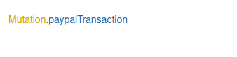
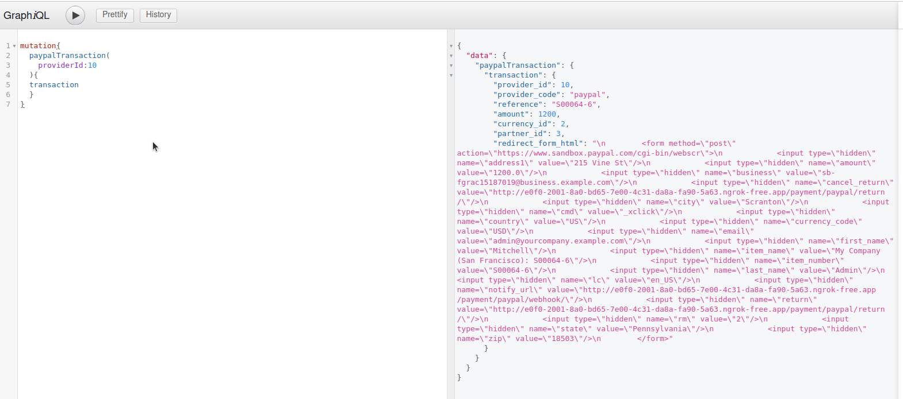
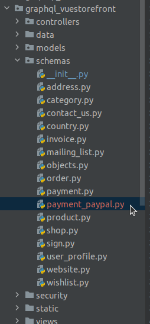
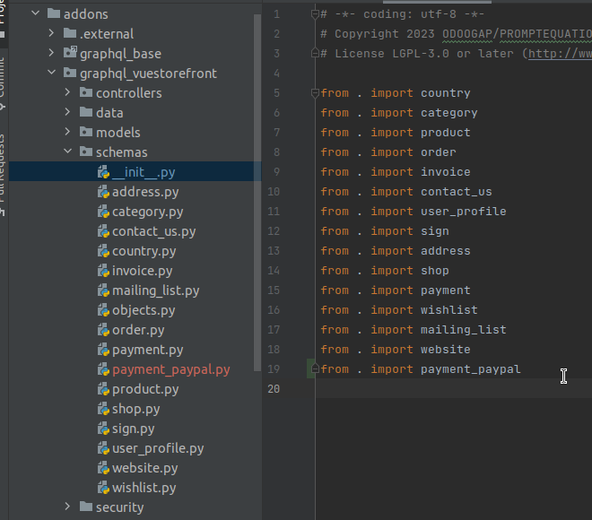
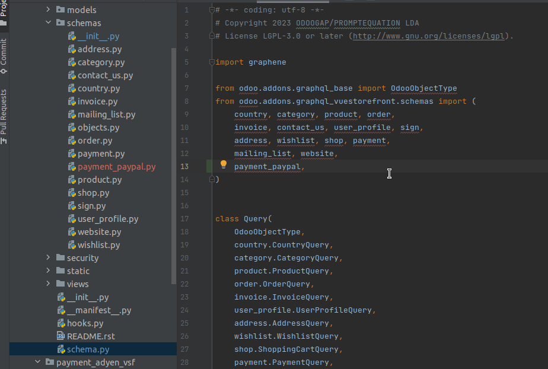
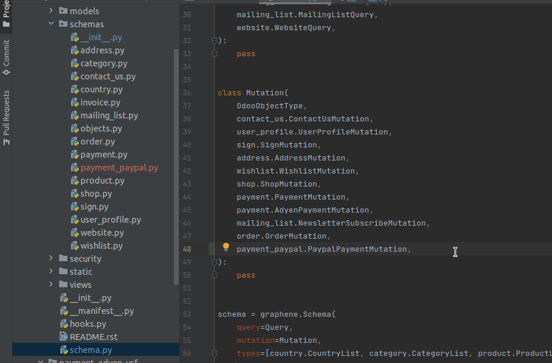
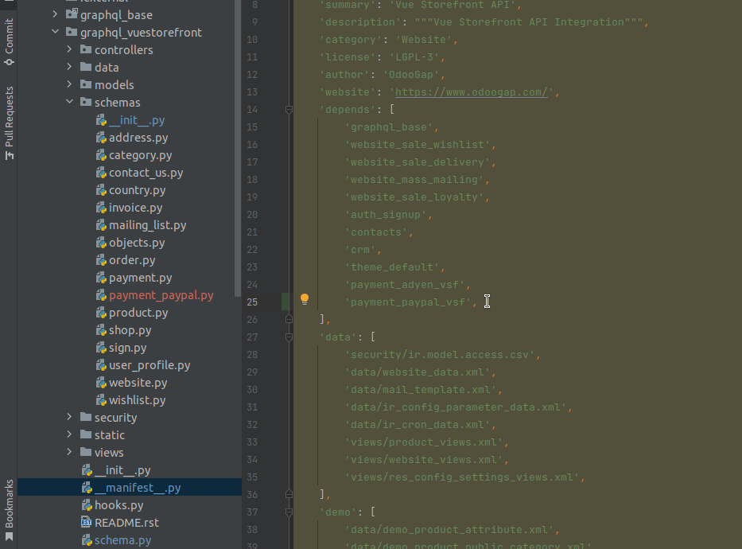

# PayPal Payment Customization

## 1- Description:

##### - Adapting the PayPal Payment Acquirer to work correctly with the VSF;

##### On this module we have 1 Mutation that should be used on the vsf website, to be possible execute one payment with the PayPal Payment Provider;

### These are the mutations:

##### paypalTransaction: - This Mutation will let us create the Payment Transaction. This Transaction will return one form that we should submit to load the PayPal Window;

## 2- How to Install:

### 2.1- We should take in consideration and use this module with the repo Vuestorefront: https://github.com/odoogap/vuestorefront

### 2.2- 

#### 2.2.1- We should copy the payment_paypal.py file, that is present on the directory /schemas, to the following directory: /graphql_vuestorefront/schemas/;

#### 2.2.2- We should import that file on the init.py file, that is present on that directory, (/graphql_vuestorefront/schemas/);

#### 2.2.3- We should import that file, on the schema.py file that exists on the graphql_vuestorefront Module and also import the mutations;

#### 2.2.4- To finish we should add this payment_paypal_vsf Module as a dependency on the graphql_vuestorefront Module;

